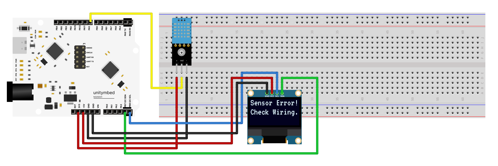

# N32G031 — OLED + DHT11 Temperature & Humidity Monitor

Real-time climatic data tracking environment displaying live temperature & humidity updates on a 0.96" I²C OLED screen, driven by a **Nations N32G031** (Cortex-M0) decoding raw pulses from a **DHT11** sensor.

This project is fully optimized for cross-platform workflows. No complex vendor IDEs or OS-specific setups are required. Open it directly in our IDE, plug in your board, and flash instantly.


---

## Hardware

| Device | Pin | N32G031 | Notes |
| :--- | :--- | :--- | :--- |
| **DHT11** | 💛 DATA | **PA5** | Pull-up to VCC if the module lacks one |
| (Sensor) | ❤️ VCC | 3.3V / 5V | Check sensor rating |
| | 🖤 GND | GND | Common system ground |
| **OLED (I²C)** | 💚 SCL | **PB6** | I²C Serial Clock |
| (Display) | 💙 SDA | **PB7** | I²C Serial Data |
| | ❤️ VCC | 3.3V | Main supply rails |
| | 🖤 GND | GND | Common system ground |

Debug probe: Any **CMSIS-DAP** adapter over **SWD** (Supported out-of-the-box).

---

## Build and Flash (Universal Cross-Platform)

Whether you are using **Windows** or **macOS**, our integrated IDE environment handles the heavy lifting behind the scenes.

1. **Open Project:** Open this project folder directly in the IDE.
2. **Build & Flash:** Simply click the **Build** and **Flash** button on the interface.
   * *Manual alternative:* Run `make` to compile, and use the custom batch routine to flash your image in less than 2 seconds.

---

## 🤖 AI Prompting Guide in our IDE

Students can use the built-in AI Assistant in the IDE to explore, debug, and modify this project. Try pasting these example prompts into the AI Chat window:

* **To Learn:** `"Explain the custom register timing logic used to wake up the DHT11 sensor and capture its single-wire data transmission stream without using standard HAL libraries."`
* **To Experiment:** `"I want to change the OLED display layouts so it shows the temperature unit in Fahrenheit instead of Celsius. Provide the modified code snippets for oled.c."`
* **To Debug:** `"My screen shows 'Sensor Error!'. Walk me through a step-by-step diagnostic checklist using the IDE terminal to confirm if the issue is hardware or software."`

---

## Behaviour

| State | Screen Display Status |
| :--- | :--- |
| **Boot** (1.5 s) | Displays `System Ready` during sensor initialization and stabilize cycles. |
| **Normal** | Displays `Temp: XX °C` / `Humidity: XX %` — updates dynamically only on real metric shifts to avoid flicker. |
| **Error** | Displays `Sensor Error!` / `Check Wiring.` if the single-wire handshakes timeout. |

| Boot | Normal | Error |
| :---: | :---: | :---: |
|  |  |  |

---

## Layout

```
src/         application + drivers used (main, oled, dht11, utils, system, it)
inc/         project headers (oled.h, dht11.h, fonts.h, …)
drivers/     Nations N32G031 peripheral library (src/ + inc/)
startup/     startup_n32g031_gcc.s  (vector table, Reset_Handler)
filemain/    alternate main() revisions kept for reference
n32g031_flash.ld   linker script (64K flash @ 0x08000000, 8K RAM)
openocd.cfg        CMSIS-DAP/SWD flash routine (n32_program)
Makefile           cross-platform build
unitymbed.json     project manifest
```

---

Part of the [UnityMbed](https://github.com/GRB-UNITYMBED) N32G031 example set.
