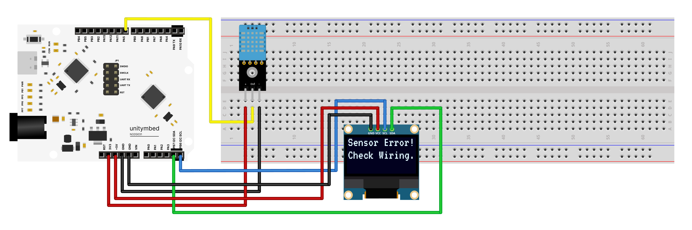

# N32G031_OLED_DHT11 — Smart Temperature and Humidity Monitor

A real-time temperature and humidity monitoring system displaying data on an OLED screen, using the N32G031 microcontroller and a DHT11 sensor. This project is fully optimized for cross-platform workflows using UnityMbed.

---

## 🔌 Wiring

| Device | Pin | N32G031 | Notes |
| :--- | :--- | :--- | :--- |
| **DHT11** | 💛 DATA / OUT | **PA5** | Requires a pull-up resistor (if not built into the module) |
| | ❤️ VCC | 3.3V / 5V | Check sensor voltage rating |
| | 🖤 GND | GND | Common system ground |
| **OLED (I2C)**| 💙 SCL | **PB6** | I2C Clock |
| | 💚 SDA | **PB7** | I2C Data |
| | ❤️ VCC | 3.3V | Display power supply |
| | 🖤 GND | GND | Common system ground |

---

## 🚀 Behaviour & Execution

**Screen Prompts & Output**
| 1. Boot Screen | 2. Normal Operation | 3. Error State |
| :--- | :--- | :--- |
| Upon startup, the screen displays a welcome message for 1.5 seconds.  **Display:** `System Ready` | The system updates the numbers only when the values change to prevent screen flickering.  **Display:** `Temp:     XX °C` `Humidity: XX %` | If the DHT11 is disconnected or damaged, the system clears the screen and displays a warning.  **Display:** `Sensor Error!` `Check Wiring.` |
|  |  |  |

---

## 🛠️ Hardware Setup & Troubleshooting

* **Screen constantly shows "Sensor Error! Check Wiring.":** Ensure the PA5 wire is not loose and verify the DHT11 VCC/GND connections are correct.
* **OLED screen is completely dark:** Check if the PB6 (SCL) and PB7 (SDA) wires are swapped, and verify the 3.3V power supply.

---

## ⚡ Build and Flash (Universal Cross-Platform)
1. **Open Project:** Open this project folder directly in the IDE.
2. **Build & Flash:** Simply click the **Build** and **Flash** buttons on the interface.

---
Part of the [UnityMbed](https://github.com/GRB-UNITYMBED) N32G031 example set.
